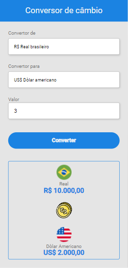


 
  

<h1 align="center"> Projeto conversor de câmbio </h1>

<h5 align="center"> Objetivo criar com o máximo de animações para treinar </h5>
<a  href="https://teste-site-ao-ar.vercel.app">Click aqui para ver o site no ar</a>

 

<h2 id="table-of-contents"> :book: Passo a passso</h2>

  
Processos

  <ol>
    <li><a href="#HTML1"> ➤ HTML </a></li>
    <li><a href="#CSS2"> ➤ CSS </a></li>
    <li><a href="#Javascript3"> ➤ Javascript </a></li>
   
  
  </ol>

<!-- ABOUT THE PROJECT -->
<h2 id="about-the-project"> :pencil: Sobre o projeto</h2>

 
#

<h2 id="overview"> :cloud: Visão geral</h2>

 
 #

<h2 id="project-files-description"> :floppy_disk: Descrição dos arquivos do projeto </h2>

<ul>
  <li><b>#</b> - #</li>
  <li><b>#</b> - #</li>
  <li><b>#</b> - #</li>
  <li><b>#</b> - #</li>
  <li><b>#</b> - #</li>
</ul>

<h3>Alguns outros arquivos de suporte </h3>
<ul>
  <li><b>#</b> - #</li>
</ul>

<!-- GETTING STARTED -->
<h2 id="getting-started"> :book: Abas de experiência</h2>

Você pode apertar nas abas indicadas para te levar a um conjunto de projetos que fiz:

<pre><code>$ </code></pre>

Você pode ver todas as opções de projeto aqui:

<pre><code>$ # </code></pre>

<h2 id="HTML1"> :small_orange_diamond: HTML </h2>

#:

<pre><code>$ #</code></pre>
>

 

<!--height="382px" width="737px"-->

<h2 id="CSS2"> :small_orange_diamond: CSS</h2>

#

<pre><code>$#</code></pre>

 

<h2 id="Javascript3"> :small_orange_diamond: Javascript</h2>

#

<pre><code>$ #</code></pre>

 

<h2 id="credits"> :scroll: Credits</h2>

Samuel Santos Guedes

